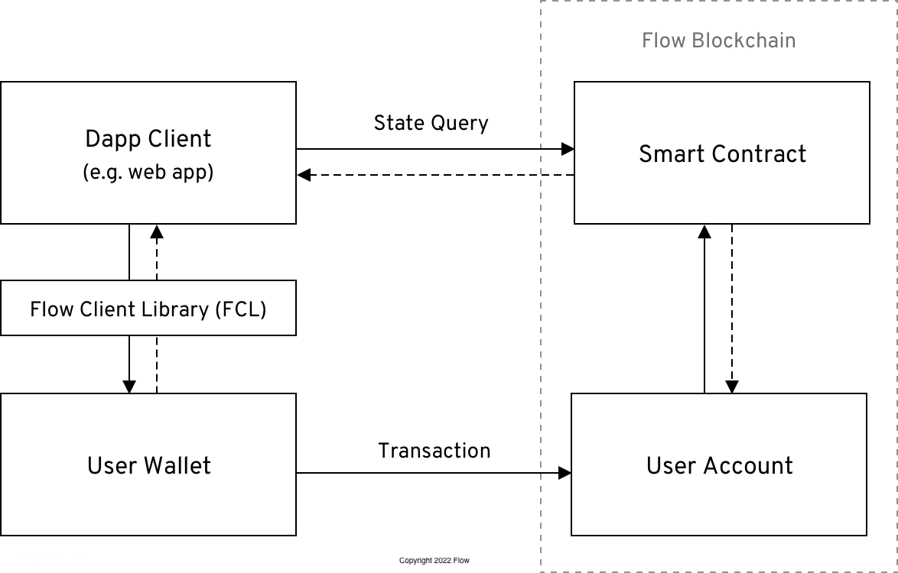
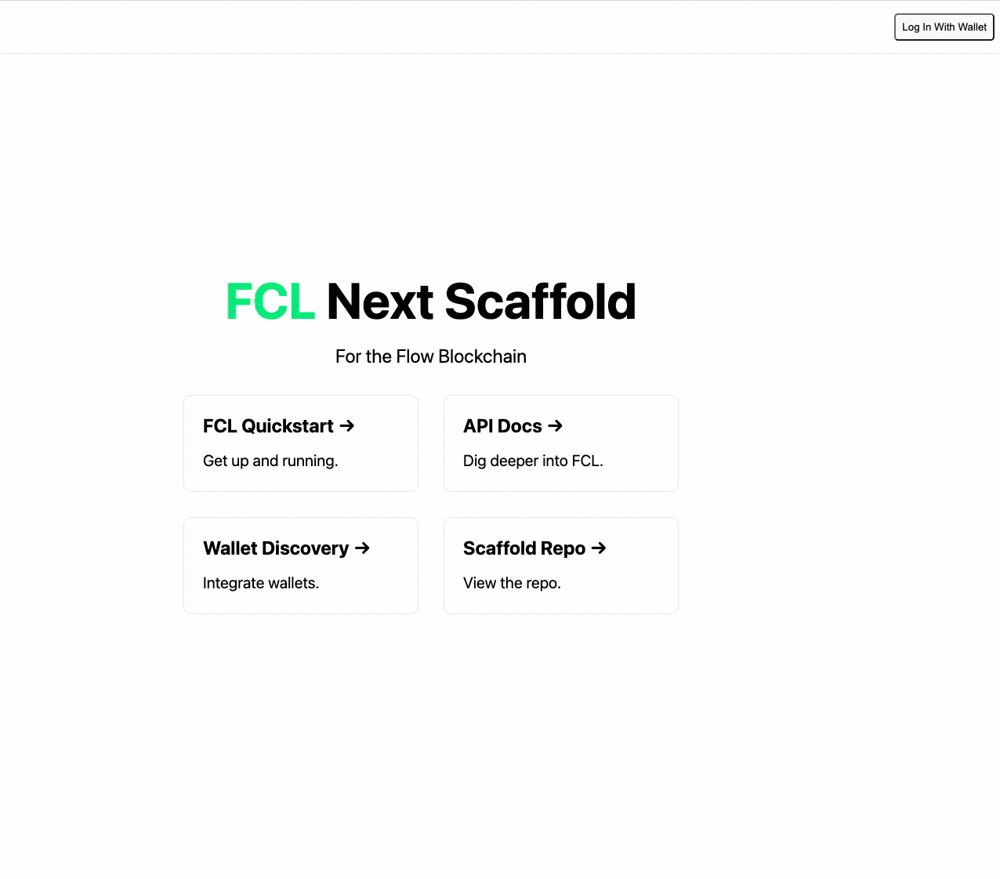
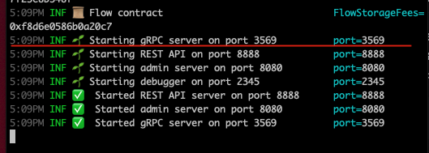
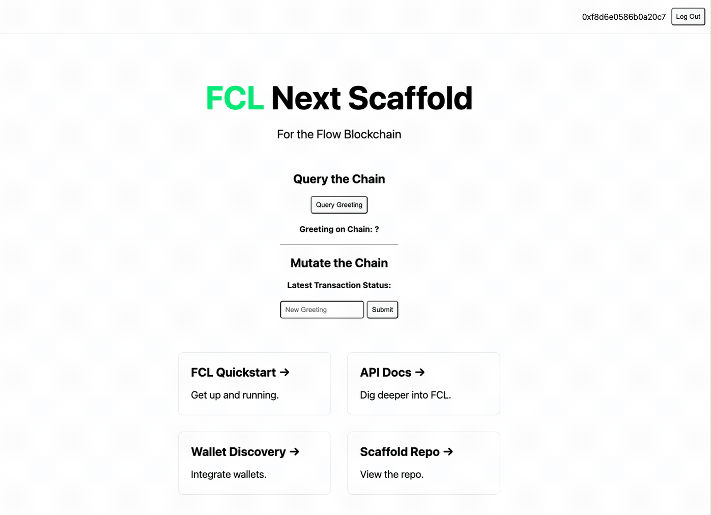

# Create a Web App on Flow

---

This guide is a simple walkthrough to get started building a web3 app using the Flow Client Library (FCL).

:::info

If you are looking for a scalfolds, check out [scaffolds available in the Flow CLI](../../tools/flow-cli/super-commands.md#using-scaffolds).

:::

This simple guide uses the "Hello World" scaffold, it is meant to provide all the code needed to get a web application up and running.

## Introduction



:::info

FCL (aka Flow Client Library) wraps the logic needed to communicate with the Flow blockchain. It's a npm package, [More Information](../../tools/clients/fcl-js)

:::

This guide assumes a good understanding of React. The concepts are easy to understand and apply to other libraries and framework. A strong understanding of Cadence (Flow's smart contract language) is not required. More information on Cadence, [learning the Cadence language](../smart-contracts/cadence.md).

### FCL concepts covered:

- [Installation](#installation)
- [Configuration](#configuration)
- [Authenticate a user](#authenticate-a-user)
- [Deploy contracts](#deploy-contracts)
- [Query the Blockchain](#query-the-blockchain)
- [Mutate the Blockchain](#mutate-the-blockchain)

For more help, [Discord](https://discord.gg/flow). See links at the end of this article for diving deeper into building on Flow.

## Installation

Make sure you have Flow CLI installed. [installation instructions](../../tools/flow-cli/install.md).

## Configuration

### Setting up Flow

Using the Flow CLI scaffold, create a basic hello world web project with `Web Scaffolds` -> `[5] FCL Web Dapp`. This will create a new `flow.json` file in the `hello-world` folder. This file will contain the Flow configuration for your project.

```sh
flow setup hello-world --scaffold
# select scaffold 5
cd hello-world
npm install
# run the app in a later step
```

We don't recommend keeping private keys in your `flow.json`, notice that Flow CLI already moved the emulator private key to a `emulator.key` file and point to it using the [key/location pattern](../../tools/flow-cli/flow.json/security.md#private-account-configuration-file). This file should be added to your `.gitignore` file, so it won't be committed to your repository. 

We won't be using emulator and running contracts locally in this quickstart, but FCL will complain if it finds private keys in your `flow.json` file.

Your `flow.json` file should look like this:

```
{
	"networks": {
		"emulator": "127.0.0.1:3569",
		"mainnet": "access.mainnet.nodes.onflow.org:9000",
		"testnet": "access.devnet.nodes.onflow.org:9000"
	},
	"accounts": {
		"emulator-account": {
			"address": "f8d6e0586b0a20c7",
			"key": {
				"type": "file",
				"location": "./emulator.key"
			}
		}
	}
}
```

:::info

The `flow.json` file is used to keep track of deployed contracts and accounts. [More Information](../../tools/clients/fcl-js/api#using-flowjson)

:::

### Configuring FCL

Next, notice `@onflow/fcl` has been added to the `package.json` and the web application is ready to be run. 

:::info

There are a lot of benefits to getting familiar with existing Flow CLI scaffolds. For example the `hello-world` scaffold already has fcl configuration settings to run on local emulator. 

:::


The `hello-world` web application comes with convenience npm commands to facilitate a quick start. The following command will preform: 
  1. Start emulator
  2. Start dev wallet
  3. Start web app

:::info

Emulator is a local blockchain [More Information](../../tools/emulator/index.md). Emulator has all the features as testnet and mainnet blockchains 

:::

```sh
npm run dev:local
```

Now that your app is running. FCL loads the configuration in `config/fcl.ts` This file contains configuration information for FCL, such as what Access Node and wallet discovery endpoint and which network to use (e.g. testnet or a local emulator). 

- `accessNode.api` key specifies the address of a Flow access node. There are publically available access nodes, but have to rate limit. Alternatively, applications might want to run an Observer node [Run a Node](../../networks/node-ops/access-onchain-data/light-nodes/observer-node.md).
- `discovery.wallet` is an address that points to a service that lists FCL compatible wallets. Flow's FCL Discovery service is a service that FCL wallet providers can be added to, and be made 'discoverable' to any application that uses the `discovery.wallet` endpoint.

Also, notice that `package.json` uses `NEXT_PUBLIC_FLOW_NETWORK=local` for `dev` command, this is used to set the network in `config/fcl.ts`.

:::info

Learn more about [configuring Discovery](../../tools/clients/fcl-js/discovery.md) or [setting configuration values](../../tools/clients/fcl-js/api.md#setting-configuration-values).

:::

The main Next.js app component is located in `pages/_app.tsx`. It should import the config file `config/fcl.ts` already and should look like this:

```jsx
import '../styles/globals.css'
import DefaultLayout from '../layouts/DefaultLayout'

// Import FCL config
import '../config/fcl'

function MyApp({ Component, pageProps }) {
  return (
    <DefaultLayout>
      <Component {...pageProps} />
    </DefaultLayout>
  )
}

export default MyApp

```

The main page for the Next.js app is located in `pages/index.tsx`. It should contain some basic UI and should look like this:

```jsx
import Head from 'next/head'
import styles from '../styles/Home.module.css'
import Links from '../components/Links'
import Container from '../components/Container'
import useCurrentUser from '../hooks/useCurrentUser'

export default function Home() {
  const { loggedIn } = useCurrentUser()

  return (
    <div className={styles.container}>

      <Head>
        <title>FCL Next Scaffold</title>
        <meta name="description" content="FCL Next Scaffold for the Flow Blockchain" />
        <link rel="icon" href="/favicon.ico" />
      </Head>

      <main className={styles.main}>
        <h1 className={styles.title}>
          <a href="https://developers.flow.com/tools/fcl-js">FCL</a> Next Scaffold
        </h1>

        <p className={styles.description}>
          For the Flow Blockchain
        </p>

        {loggedIn && <Container />}

        <Links />

      </main>
    </div>
  )
}

```

Now we're ready to start talking to Flow! 

:::warning

The web app will run, but there are no contracts deployed to local emulator. This is a step in [Query the Blockchain](#query-the-blockchain) section. 

:::

## Authenticate a User



Note: in the code above `useCurrentUser` is used to determine if there is a logged in user. 

There are two methods to allow the user to login. `fcl.logIn()` or `fcl.authenticate()` [More Information on, authenticate](../../tools/clients/fcl-js/api#authenticate)

In `components/Navbar.tsx` a button wires up the authentication method `fcl.authenticate()`. It is used to bring up the list of supported wallets. See below

Once authenticated, FCL uses a hook `const user = useCurrentUser()` to get the user data, when user is signed in `user.loggedIn` flag is `true`. For more information on the `currentUser`, read more [here](../../tools/clients/fcl-js/api.md#current-user).

```jsx
import Head from 'next/head'
import * as fcl from '@onflow/fcl'
import useCurrentUser from '../hooks/useCurrentUser'
import navbarStyles from '../styles/Navbar.module.css'
import elementStyles from '../styles/Elements.module.css'

export default function Navbar() {
  const user = useCurrentUser()

  return (
    <div className={navbarStyles.navbar}>
      {!user.loggedIn && 
        <button 
          onClick={fcl.authenticate} 
          className={elementStyles.button}>
          Log In With Wallet
        </button>
      }
      {user.loggedIn && 
        (
          <>
            <div className={navbarStyles.address}>{ user?.addr }</div>
            <button 
              onClick={fcl.unauthenticate} 
              className={elementStyles.button}>
              Log Out
            </button>
          </>
        )
      }
    </div>
  )
}

```

You should now be able to log in or sign up users and unauthenticate them. Upon logging in or signing up your users will see a popup where they can choose between wallet providers. Choose the `dev wallet` to use the same account that deployed the `HelloWorld` contract, this is needed for mutation. Upon completing authentication, you'll see the component change and the user's wallet address appear on the screen if you've completed this properly.

:::info

More on wallets, [Flow Core wallet](https://core.flow.com/) is a Reference Flow wallet. 

:::

## Deploy contracts

Hello World scaffold does come with a Cadence contract. You will notice `HelloWorld.cdc` has been deployed when running `npm run dev:local`. Look at hello-world `package.json` to see the commands that get run, `flow dev` deploys contracts to the emulator.
In the `flow.json` make sure the emulator endpoint is correct. Look at the terminal the emulator is running, 



1. Make sure the emulator is using the same port as `gRPC` and 
2. The `deployment` section of `flow.json` should look something like this: 
```json
  ...
	"networks": {
		"emulator": "127.0.0.1:3569",
    ...
  },
	"deployments": {
		"emulator": {
			"default": [
				"HelloWorld"
			]
		}	
}	

```

Verify that `flow.json` updates with HelloWorld contract information, `contracts` has the `HelloWorld` contract and `deployments` shows that `HelloWorld` has been deployed.


```json
{
	"contracts": {
		"HelloWorld": "cadence/contracts/HelloWorld.cdc"
	},
	"networks": {
		"emulator": "127.0.0.1:3569",
		"mainnet": "access.mainnet.nodes.onflow.org:9000",
		"testnet": "access.devnet.nodes.onflow.org:9000"
	},
	"accounts": {
		"default": {
			"address": "01cf0e2f2f715450",
			"key": "..."
		},
		"emulator-account": {
			"address": "f8d6e0586b0a20c7",
			"key": {
				"type": "file",
				"location": "./emulator.key"
			}
		}
	},
	"deployments": {
		"emulator": {
			"default": [
				"HelloWorld"
			]
		}
	}
}
```

For more information on deployments check [Flow CLI](../../tools/flow-cli/flow.json/manage-configuration.md) documentation

## Query the Blockchain

Now that all pieces are in place. UI can query `HelloWorld` contract.


The script that queries the Hello World contract is located `hello-world/cadence/scripts/ReadHelloWorld.cdc`

```cadence
import "HelloWorld"

access(all) fun main(): String {
  return HelloWorld.greeting
}
```

In `components/Container.tsx` file, `fcl.query` is used to set the Cadence script and query the contract.

```jsx

  const queryChain = async () => {
    const res = await fcl.query({
      cadence: ReadHelloWorld
    })

    setChainGreeting(res)
  }
```

It is that simple!

## Mutate the Blockchain

Update the `HelloWorld` contract greeting. Notice that Greeting gets changed when the transaction gets processed.




In `components/Container.tsx` file, the `mutateGreeting` method `fcl.mutate` sends `UpdateHelloWorld` cadence which triggers a transaction that the user signs.

```javascript
 const mutateGreeting = async (event) => {
    event.preventDefault()

    if (!userGreetingInput.length) {
      throw new Error('Please add a new greeting string.')
    }

    const transactionId = await fcl.mutate({
      cadence: UpdateHelloWorld,
      args: (arg, t) => [arg(userGreetingInput, t.String)],
    })

    setLastTransactionId(transactionId)
  }

```

## More information

That's it! You now have Flow app that uses auth, query and mutate the chain. This is just the beginning. There is so much more to know. Next steps:

**Cadence**
- [Cadence Playground Tutorials](https://cadence-lang.org/docs/tutorial/first-steps)
- [Cadence Hello World Video](https://www.youtube.com/watch?v=pRz7EzrWchs)
- [Why Cadence?](https://www.onflow.org/post/flow-blockchain-cadence-programming-language-resources-assets)

**FCL Scaffolds**
- [FCL Next TypeScript Scaffold](https://github.com/chasefleming/fcl-next-scaffold)
- [FCL React Native Scaffold](https://github.com/jribbink/fcl-react-native-scaffold)

**Full Stack NFT Marketplace Example**
- [Beginner Example: CryptoDappy](https://github.com/bebner/crypto-dappy)

**More FCL**
- [FCL API Quick Reference](../../tools/clients/fcl-js/api)
- [More on Scripts](../../tools/clients/fcl-js/scripts.md)
- [More on Transactions](../../tools/clients/fcl-js/transactions.md)
- [User Signatures](../../tools/clients/fcl-js/user-signatures.md)
- [Proving Account Ownership](../../tools/clients/fcl-js/proving-authentication.mdx)

**Other**
- [Flow Developer Onboarding Guide](../../tutorials/intro.md)
